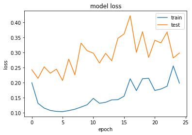

# Pneumonia-Diagnosis-using-XRays-96-percent-Recall
Best score on kaggle &nbsp; []()

[]()
[]()


# Chest Xray Pneumonia Detection
<b>Abstract</b>:&nbsp;Pneumonia is an infection that inflames the air sacs in one or both lungs. The air sacs may fill with fluid or pus (purulent material), causing cough with phlegm or pus, fever, chills, and difficulty breathing. A variety of organisms, including bacteria, viruses and fungi, can cause pneumonia.

<b>Cell image pre-processing and compilation of dataset for deep learning</b>:&nbsp;
The images used in this work were whole slide images provided in the PEIR-VM repository built by the University of Alabama in Birmingham. The original whole slide image data contain significant amount of redundant information. In order to achieve good classification accuracy, image segmentation and de-noising are needed to extract only blood cells and remove those redundant image pixels simultaneously. Several effective image processing techniques were used to accurately segment tiles into individual cells.

<b>Task</b>:&nbsp;Now we have to Regcognise the future images and give the prediction result


<h1>Context</h1>
http://www.cell.com/cell/fulltext/S0092-8674(18)30154-5


Figure S6. Illustrative Examples of Chest X-Rays in Patients with Pneumonia, Related to Figure 6 The normal chest X-ray (left panel) depicts clear lungs without any areas of abnormal opacification in the image. Bacterial pneumonia (middle) typically exhibits a focal lobar consolidation, in this case in the right upper lobe (white arrows), whereas viral pneumonia (right) manifests with a more diffuse ‘‘interstitial’’ pattern in both lungs. 
http://www.cell.com/cell/fulltext/S0092-8674(18)30154-5<br>


<h1>Content</h1>
The dataset is organized into 3 folders (train, test, val) and contains subfolders for each image category (Pneumonia/Normal). There are 5,863 X-Ray images (JPEG) and 2 categories (Pneumonia/Normal).

Chest X-ray images (anterior-posterior) were selected from retrospective cohorts of pediatric patients of one to five years old from Guangzhou Women and Children’s Medical Center, Guangzhou. All chest X-ray imaging was performed as part of patients’ routine clinical care.

For the analysis of chest x-ray images, all chest radiographs were initially screened for quality control by removing all low quality or unreadable scans. The diagnoses for the images were then graded by two expert physicians before being cleared for training the AI system. In order to account for any grading errors, the evaluation set was also checked by a third expert.

<h1>Acknowledgements&nbsp;:</h1>
Data: https://data.mendeley.com/datasets/rscbjbr9sj/2

License: CC BY 4.0

Citation: http://www.cell.com/cell/fulltext/S0092-8674(18)30154-5

<h1>Conclusion</h1>
<html>
<body>
    <br>
    <b>Here are the results of our three models</b> 
<table border=1>
  <tr>
    <th>Model</th>
    <th>Architecture</th>
    <th>Training Accuracy</th>
    <th>Test Accuracy</th>
  </tr>
  <tr>
    <td>Model 1</td>
    <td>2:1 Arcitecture without using Batch Normalization and Dropout</td>
    <td>99%</td>
    <td>93%</td>
  </tr>
  <tr>
    <td>Model 2</td>
    <td>4:2 Achitecture using Batch Normalization and Dropout</td>
    <td>99%</td>
    <td>91%</td>
  </tr>
  <tr>
    <td>Model 3</td>
    <td>3:1 Convolutional layer</td>
    <td>96%</td>
    <td>93%</td>
  </tr>
</table>
</body>
</html>

<h1>Result</h1>


<h1>MIT License</h1>

```
Copyright (c) 2019 Suvhradip Ghosh

Permission is hereby granted, free of charge, to any person obtaining a copy
of this software and associated documentation files (the "Software"), to deal
in the Software without restriction, including without limitation the rights
to use, copy, modify, merge, publish, distribute, sublicense, and/or sell
copies of the Software, and to permit persons to whom the Software is
furnished to do so, subject to the following conditions:

The above copyright notice and this permission notice shall be included in all
copies or substantial portions of the Software.

THE SOFTWARE IS PROVIDED "AS IS", WITHOUT WARRANTY OF ANY KIND, EXPRESS OR
IMPLIED, INCLUDING BUT NOT LIMITED TO THE WARRANTIES OF MERCHANTABILITY,
FITNESS FOR A PARTICULAR PURPOSE AND NONINFRINGEMENT. IN NO EVENT SHALL THE
AUTHORS OR COPYRIGHT HOLDERS BE LIABLE FOR ANY CLAIM, DAMAGES OR OTHER
LIABILITY, WHETHER IN AN ACTION OF CONTRACT, TORT OR OTHERWISE, ARISING FROM,
OUT OF OR IN CONNECTION WITH THE SOFTWARE OR THE USE OR OTHER DEALINGS IN THE
SOFTWARE
```
HHHHH
